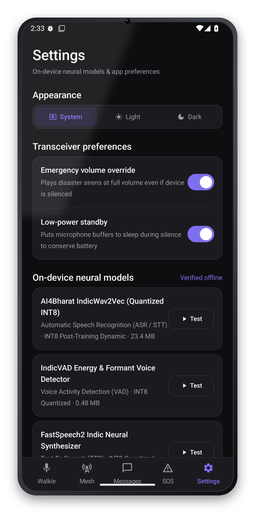
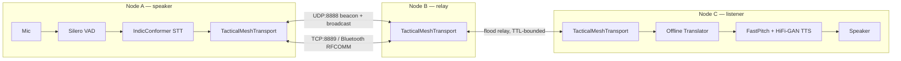

<div align="center">

# iTantra

**Offline, mesh-networked voice walkie-talkie for disaster response — in 10 Indian languages.**

No internet. No cell towers. No cloud. Speak in your language, the person on the other end hears it in theirs — relayed phone-to-phone over Wi-Fi Direct, Bluetooth and BLE.

[](https://kotlinlang.org)
[](https://developer.android.com/jetpack/compose)
[](https://developer.android.com/)
[](https://onnxruntime.ai/)
[](https://github.com/k2-fsa/sherpa-onnx)
[](LICENSE)

</div>

---

## Why

When a cyclone knocks out cell towers and the internet along a coastline, rescue teams and villagers still need to talk to each other — and not everyone in the affected region speaks the same language. iTantra turns any two (or more) Android phones into a walkie-talkie network that:

- needs **zero infrastructure** — no SIM, no Wi-Fi router, no data connection,
- **speaks and listens in the local language** on each end, translating in between,
- keeps working as a **multi-hop mesh** so a message can travel A → B → C even when A and C are out of each other's range,
- and can blast a **priority distress alert** to every connected node at once.

Built for the Smart India Hackathon around a disaster-management / space-comms (ISRO-styled) brief.

## Features

**Offline voice pipeline**
- On-device Speech-to-Text: [AI4Bharat IndicConformer](https://github.com/AI4Bharat/NeMo) (CTC, INT8-quantized) via [sherpa-onnx](https://github.com/k2-fsa/sherpa-onnx), with [Silero VAD](https://github.com/snakers4/silero-vad) doing real-time voice-activity/end-of-sentence detection.
- On-device Text-to-Speech: [AI4Bharat Indic-TTS](https://github.com/AI4Bharat/Indic-TTS) — FastPitch (text → mel) + HiFi-GAN (mel → waveform) — exported to ONNX and run directly through ONNX Runtime Mobile.
- Sentence-chunked, pipelined synthesis: long messages start playing back after the first chunk synthesizes, instead of the whole utterance having to render before any sound plays.
- Fully offline: no network call is ever made to synthesize or transcribe speech.
- 10 languages: Hindi, Bengali, Marathi, Telugu, Tamil, Gujarati, Kannada, Malayalam, Odia, English — plus on-device translation so the sender's language and the listener's selected language don't have to match.

**Mesh transport**
- UDP broadcast beaconing for zero-configuration peer discovery on a shared subnet.
- TCP socket streaming (Wi-Fi Direct) and Bluetooth RFCOMM for lossless direct links; BLE scan/advertise as a lighter-weight discovery channel.
- Real multi-hop relay: a node bridges every live link it holds at once, flood-relaying packets it hasn't seen before (TTL-bounded, dedup-cached) — so two out-of-range devices can still reach each other through a phone in the middle.
- Manual direct-IP connect as a fallback when auto-discovery doesn't find a peer.

**Mission controls**
- Push-to-talk or continuous "phone mode" (VAD-segmented hands-free conversation).
- Priority distress broadcast: siren tone, forced max volume, haptic pattern, and a `CRITICAL_DISTRESS` packet flag that jumps the queue.
- Per-device role (Transceiver / STT-only / TTS-only) for mixed hearing/speaking-impaired deployments.
- Local mission voice log (Room-backed) of every message sent and received.
- Live tactical telemetry HUD: battery, signal strength, link quality, RSSI, local IP, RAM.

## Screenshots

<!--
  Drop real device/emulator screenshots into docs/screenshots/ using the names
  below (portrait, ~1080x2400 works well) and they'll show up here automatically.
  A quick way to get them: run the app, then `adb exec-out screencap -p > shot.png`
  for each screen.
-->
<table>
<tr>
<td align="center" width="20%"><br/><sub>Mission Control</sub></td>
<td align="center" width="20%"><br/><sub>Comm Link Pairing</sub></td>
<td align="center" width="20%"><br/><sub>Distress Alert</sub></td>
<td align="center" width="20%"><br/><sub>Voice Log</sub></td>
<td align="center" width="20%"><br/><sub>Settings</sub></td>
</tr>
</table>

*(Screenshots pending — see [Contributing](#contributing) if you'd like to add real device captures.)*

## Architecture



A is out of Bluetooth/Wi-Fi Direct range of C, but both are linked to B — B holds both links simultaneously and relays A's packet on to C without either endpoint configuring anything.

## Tech stack

| Layer | Technology |
|---|---|
| Language | Kotlin |
| UI | Jetpack Compose, Material 3, Navigation Compose |
| Architecture | MVVM (`AndroidViewModel` + `StateFlow`), Kotlin Coroutines/Flow |
| Persistence | Room |
| Speech-to-Text | AI4Bharat IndicConformer (nemo_ctc, INT8) via sherpa-onnx |
| Voice Activity Detection | Silero VAD (ONNX) via sherpa-onnx |
| Text-to-Speech | AI4Bharat Indic-TTS (FastPitch + HiFi-GAN), custom ONNX export, run on ONNX Runtime Mobile |
| Mesh networking | Wi-Fi Direct (`WifiP2pManager`), raw `Socket`/`ServerSocket` (TCP), `DatagramSocket` (UDP), Bluetooth Classic RFCOMM, BLE (scan/advertise) |
| Min / target SDK | API 24 / API 35 |

## Supported languages

| Language | Native | STT | TTS |
|---|---|:---:|:---:|
| Hindi | हिन्दी | ✅ | ✅ |
| Bengali | বাংলা | ✅ | ✅ |
| Marathi | मराठी | ✅ | ✅ |
| Telugu | తెలుగు | ✅ | ✅ |
| Tamil | தமிழ் | ✅ | ✅ |
| Gujarati | ગુજરાતી | ✅ | ✅ |
| Kannada | ಕನ್ನಡ | ✅ | ✅ |
| Malayalam | മലയാളം | ✅ | ✅ |
| Odia | ଓଡ଼ିଆ | ✅ | ✅ |
| English | English | — | ✅ |

New languages are added purely by dropping converted model files into `assets/models/<code>/` and a manifest entry — see `tools/model_conversion/`.

## Getting started

**Prerequisites:** [Android Studio](https://developer.android.com/studio) (Ladybug or newer), JDK 17.

```bash
git clone https://github.com/HarshCoder1122/iTantra.git
cd iTantra
```

### Model weights

The on-device STT/TTS model weights (~2.3GB across 10 languages) are **not** committed to this repo — several individual files exceed GitHub's 100MB limit. The manifest (`app/src/main/assets/models/model_manifest.json`), tokenizer vocabularies, and TTS frontend configs *are* included, describing exactly which upstream checkpoints each language pack expects and where they came from.

To run the app with real speech, regenerate the ONNX weights with the conversion scripts under `tools/model_conversion/` (`convert_stt.py`, `export_tts.py`) against the source checkpoints listed per-language in `model_manifest.json`, and drop the output into the matching `assets/models/<code>/stt/` and `assets/models/<code>/tts/` folders. Without them, a language simply reports itself as unavailable instead of faking a result — the app runs fine, it just has nothing to say yet.

### Build & run

1. Open the project root in Android Studio and let it sync.
2. Run on two physical devices (or a device + emulator) on the same Wi-Fi network / with Bluetooth enabled, to actually exercise the mesh.
3. Grant microphone, location, and nearby-devices/Bluetooth permissions when prompted — they're required for `RECORD_AUDIO`, Wi-Fi Direct discovery, and BLE/Bluetooth scanning respectively.

## Project structure

```
app/src/main/java/com/example/
├── stt/            # IndicConformer + Silero VAD speech-to-text engine
├── tts/            # FastPitch + HiFi-GAN text-to-speech engine
├── transport/      # UDP/TCP/Bluetooth/BLE/Wi-Fi Direct mesh transport
├── translation/     # Offline sender-language → receiver-language translation
├── model/          # Bundled model manifest loading & verification
├── data/           # Room database (mission voice log)
├── audio/          # Alert siren, haptics, audio focus management
├── viewmodel/      # MissionControlViewModel — app state & orchestration
└── ui/             # Compose screens & components
tools/model_conversion/  # Scripts to (re)export STT/TTS checkpoints to ONNX
```

## Models & credits

| Component | Source | License |
|---|---|---|
| STT acoustic model | [AI4Bharat IndicConformer](https://huggingface.co/ai4bharat) (via [trysem/indicconformer-120m-onnx](https://huggingface.co/trysem)) | CC-BY-4.0 |
| VAD | [Silero VAD](https://github.com/snakers4/silero-vad) | MIT |
| STT/VAD runtime | [sherpa-onnx](https://github.com/k2-fsa/sherpa-onnx) (k2-fsa) | Apache-2.0 |
| TTS acoustic + vocoder | [AI4Bharat Indic-TTS](https://github.com/AI4Bharat/Indic-TTS) (FastPitch + HiFi-GAN) | MIT |
| TTS/general ONNX runtime | [ONNX Runtime Mobile](https://onnxruntime.ai/) (Microsoft) | MIT |

## Contributing

Issues and PRs are welcome — device screenshots for the gallery above, additional language packs, and mesh-transport hardening are all good starting points.

## License

App source code is [MIT licensed](LICENSE). Bundled third-party models and libraries retain their own upstream licenses (see table above).
